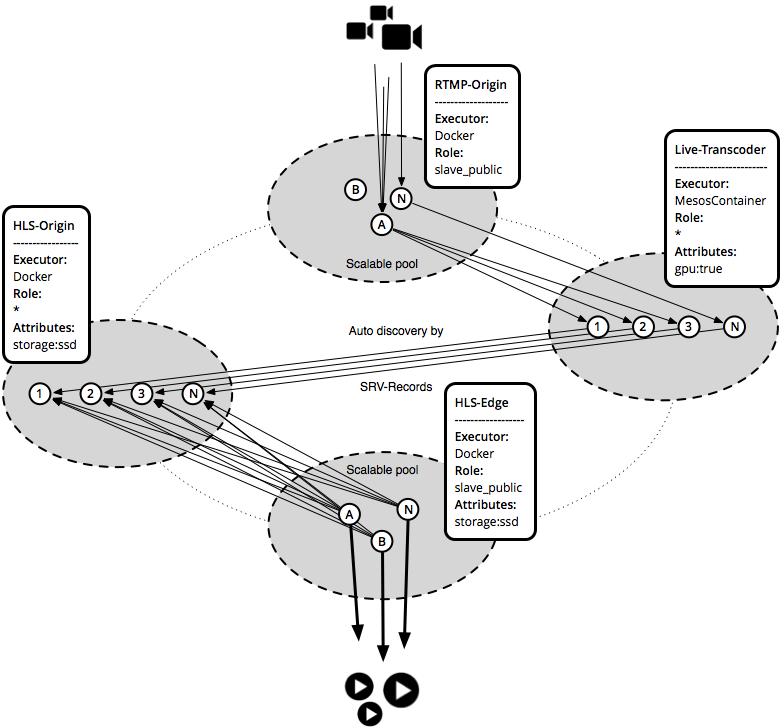

# Cluster-Lab

Open PoC to use [DC/OS]() ([Mesos]()) one big Video-Streaming-Infrastructure.   
**It's currently realy hack stuff! and not build to run it on production!**

## The idea:


## Demo

1. start the DC/OS-Package
   ```
$ dcos package repo add universe-datarhei https://github.com/datarhei/dcos-packages/archive/version-2.x.zip
$ dcos package install dispatcher
```

2. wait till the dispatcher has started the rtmp-origin and the hls-edge
3. push a livestream to the rtmp-origin
   ```
$ ffmpeg -i live-stream -c copy -f flv rtmp://ip-of-the-rmtp-origin:port-of-the-rtmp-origin/live/mystream
```

3. open the hls-edge url "http://ip-of-the-hls-edge:port-of-the-hls-edge/?stream=mystream" in your browser and have fun

## Copyright
Code released under the [Apache license](LICENSE). Images are copyrighted by datarhei.org